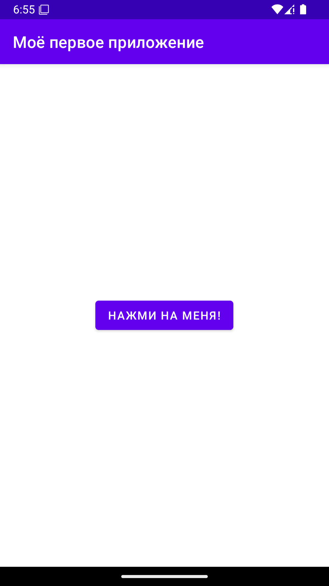
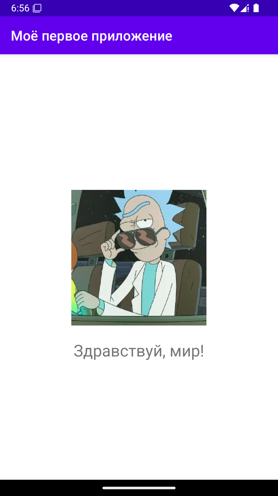
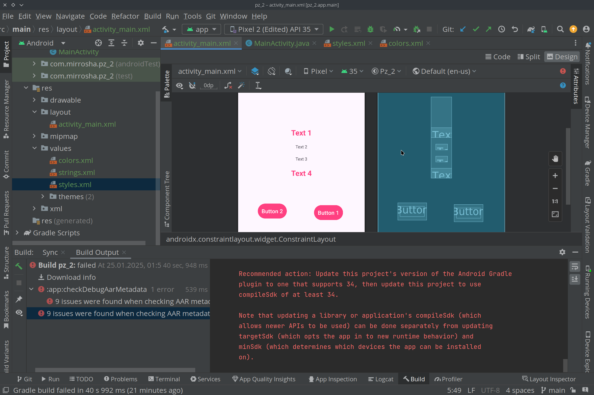
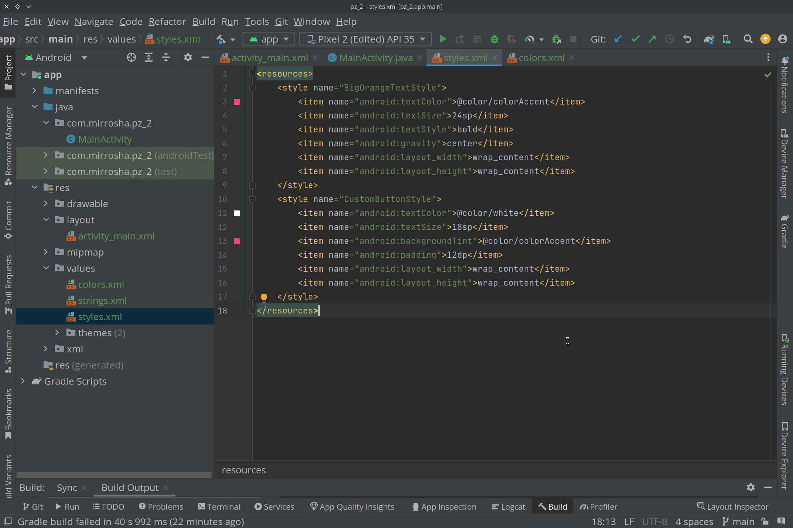
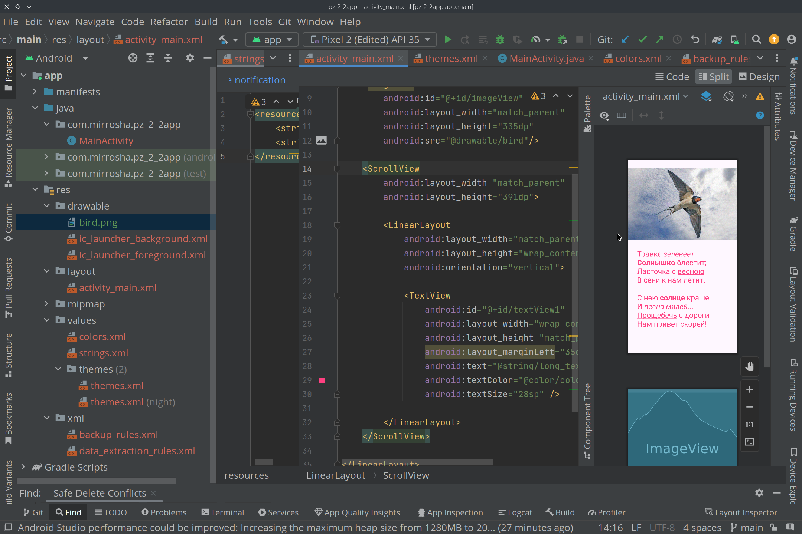
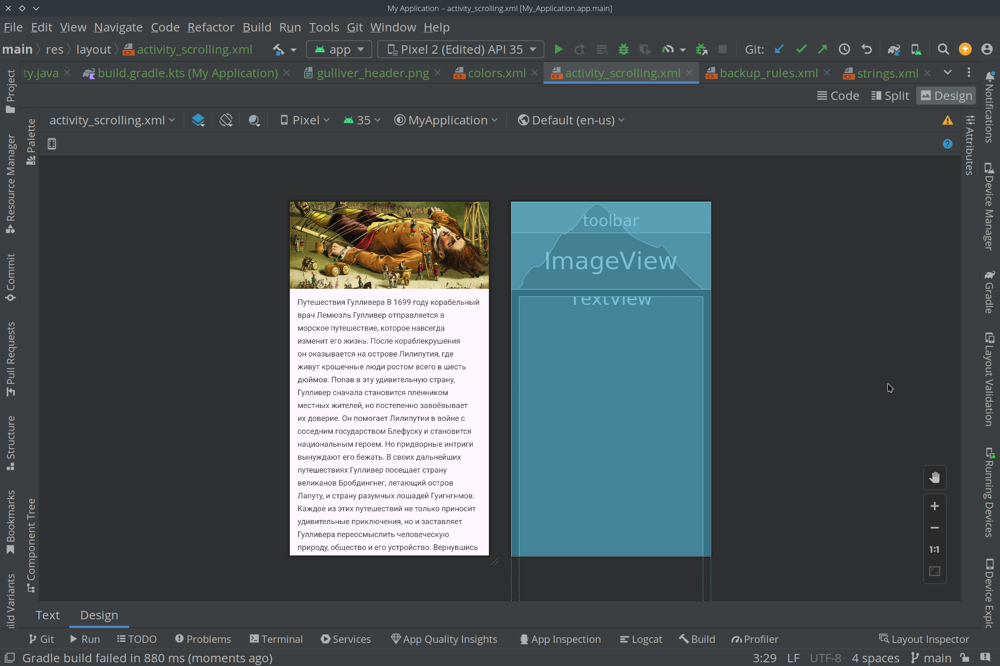

# Правктические задания по "Технологии разработки приложений для мобильных"

## ПЗ 1
Разработка приложения "Здравствуй, мир!"

  

Исходный код приложения: [/pz1app](/pz1app)

## ПЗ 2

### Задание 1
  

Исходный код приложения: [/pz_2](/pz_2)
### Задание 2

Исходный код приложения: [/pz22app](/pz22app)

### Задание 3

Исходный код приложения: [/pz23app](/pz23app)
